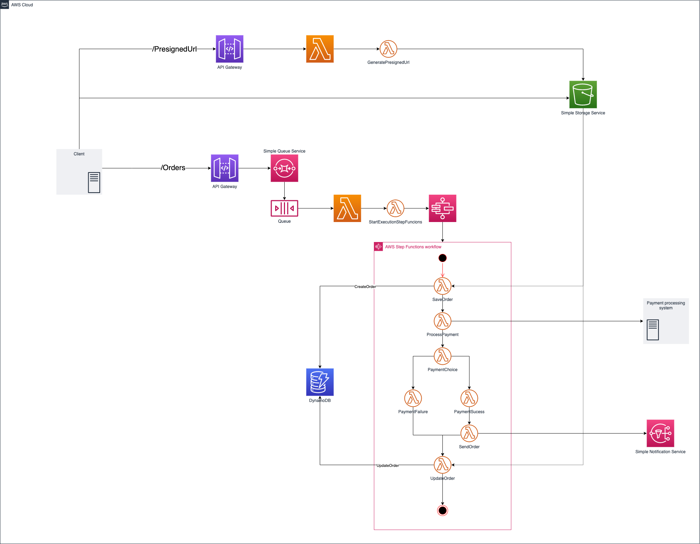

# Claim Check Pattern
Example of Claim Check Pattern in Event-Driven Architecture

### Diagram

### About the Pattern

* A messaging-based architecture at some point must be able to send, receive, and manipulate large messages. Such messages may contain anything, including images (for example, MRI scans), sound files (for example, call-center calls), text documents, or any kind of binary data of arbitrary size.
* Split a large message into a claim check and a payload. Send the claim check to the messaging platform and store the payload to an external service. This pattern allows large messages to be processed, while protecting the message bus and the client from being overwhelmed or slowed down. This pattern also helps to reduce costs, as storage is usually cheaper than resource units used by the messaging platform.

### considerations

* Consider deleting the message data after consuming it, if you don't need to archive the messages. Although S3 storage is relatively cheap, it costs some money in the long run, especially if there is a lot of data. Deleting the message can be done synchronously by the application that receives and processes the message, or asynchronously by a separate dedicated process. The asynchronous approach removes old data with no impact on the throughput and message processing performance of the receiving application.
* Storing and retrieving the message causes some additional overhead and latency. You may want to implement logic in the sending application to use this pattern only when the message size exceeds the data limit of the message bus. The pattern would be skipped for smaller messages. This approach would result in a conditional claim-check pattern.

## Exemplified Business
Create a order to buy something

## Choreography and orchestration

* **Endpoints**:
  * **/PresignedUrl**: Endpoint to provides the URL to the object.
    * **Response**: Request URL to update objects in S3

  * **/Orders**: Endpoint to create a buy order
    * **Response**: Request Message ID from SQS to track the order

* **Lambdas**:
    * **GeneratePresignedUrl**:
        * **Objective**: The lambda assumes a role with IAM permissions to make the API call to amazon S3

    * **WebScoketIDMessage**:
        * **Objective**: save the message ID to the dynamoDB table in addition to the execution ARN and websocket, for client polling the websocket url based on message ID

    * **StartExecutionStepFuncions**:
        * **Objective**: Send informations of order,ID of message,request ID and URL to access objects to start StepFunctions workflow

    * **SaveOrder**:
        * **Objective**: Create the Order with the payload client, the message ID,request ID and information from the object on S3

    * **UpdateOrder**:
        * **Objective**: Update the Order with results of payment operation and information from the object on S3

* **SNS Webhook**:
    * **Objective**: Send a message to topic subscribers. The message includes information about the orders and what the client service needs
