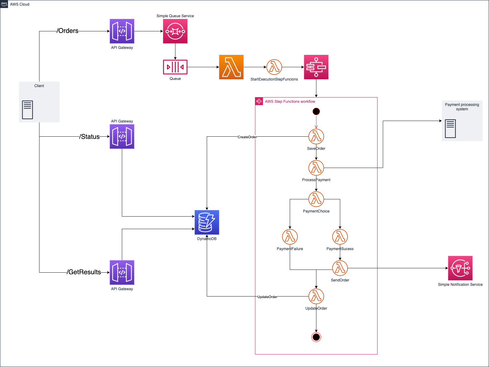

# Client Polling Pattern
Example of Client Polling Pattern in Event-Driven Architecture

### Diagram

### About the Pattern

* Client polling is a common way to get status information on a long-running transaction
* This diagram illustrates an architecture that uses client polling to get the status of a task

### Advantages

* Easy to replace a synchronous flow

### Disadvantages

* Adds additional latency to the consistency of the data to the client
* Unnecessary work and increased cost for requests/responses when nothing has changed

## Exemplified Business
Create a order to buy something

## Choreography and orchestration

* **Endpoints**:
  * **/Orders**: Endpoint to create a buy order
    * **Response**: Message ID from SQS to track the order
  * **/Status**: Endpoint to track the status of order
    * **Response**: Status of order
  * **/GetResults**: Endpoint to get the result of the orders operation
    * **Response**: Result of order

* **StartExecutionStepFuncions**:
  * **Objective**: Get the informations of order and the ID of message to start StepFunctions workflow

* **SaveOrder**:
  * **Objective**: Create the Order with the payload client and the message ID

* **UpdateOrder**:
  * **Objective**: Update the Order with results of payment operation

