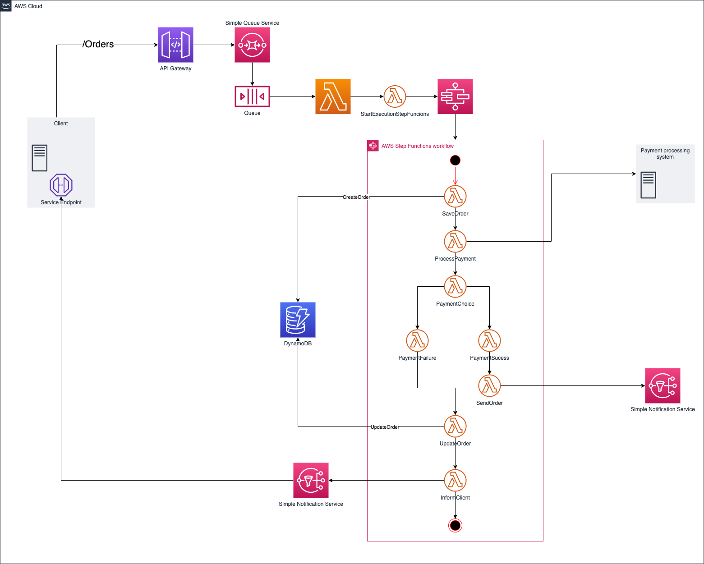

# Webhook Pattern
Example of Webhook Pattern in Event-Driven Architecture

### Diagram

### About the Pattern

* One way to improve on the polling approach would be to use webhooks. Webhooks are user-defined HTTP callbacks
* With trusted clients, you can use Amazon SNS to set up an HTTP subscriber that notifies the client using the webhook. An added benefit to using SNS with HTTP subscribers is that it can model retry behaviors and exponential backoffs until the webhook succeeds

### Advantages

* Work very well in server-to-server systems due to how they operate. Because the system essentially functions as the aforementioned “if this then do”, servers can be configured to tie into pre-formed URIs at any time and execute a given function whenever that event is triggered
* Additionally, WebHooks have the unique benefit of being based upon HTTP. This means that the system can be integrated without utilizing any new infrastructure, allowing speedy adoption and relatively simple setup.

### Disadvantages

* The problem with WebHooks is that a lot of their functionality can already be placed on the arguably more powerful REST architectural approach. While adopting event-driven architecture is often a requirement of the service being built, it’s a hard sell when it can be mirrored in REST while also giving the wealth of options that REST gives to the user
* WebHooks can be resource intensive to both the client and the server. If the client needs to notify many servers that an event has occurred, and a server needs to listen to a great deal of clients notifying of this change, you can very quickly run into a situation where your network grows uncontrollably. While HTTP does scale quite well, this is a definite negative to consider

## Exemplified Business
Create a order to buy something

## Choreography and orchestration

* **Endpoints**:
  * **/Orders**: Endpoint to create a buy order
    * **Response**: Request ID back from API Gateway

* **Lambdas**:
    * **StartExecutionStepFuncions**:
        * **Objective**: Send informations of order,ID of message and request ID to start StepFunctions workflow

    * **SaveOrder**:
        * **Objective**: Create the Order with the payload client, the message ID and request ID

    * **UpdateOrder**:
        * **Objective**: Update the Order with results of payment operation

    * **InformClient**:
        * **Objective**: Publishes a message to SNS when finished

* **SNS Webhook**:
    * **Objective**: Send a message to topic subscribers. The message includes information about the orders and what the client service needs
