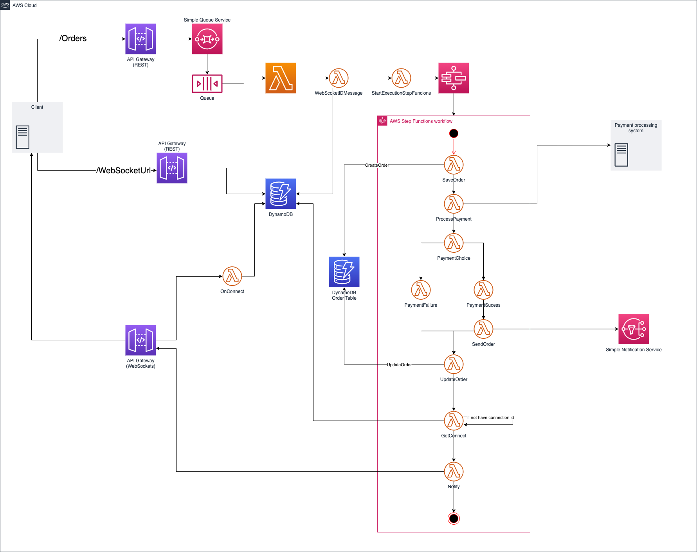

# Websocket Pattern
Example of Websocket Pattern in Event-Driven Architecture

### Diagram

### About the Pattern

* WebSockets are an interesting event-driven solution, because, for most browsers, they’re actually baked into the application itself. Essentially, WebSocket is a protocol that provides full-duplex communication on a single TCP connection. It was standardized by the Internet Engineering Task Force as RFC 6455, and the WebSocket API in Web IDL was later standardized under the W3C banner
* Combine the polling and WebSockets patterns so that you can still use Amazon SQS to create the asynchronous connection up front and use polling to get the WebSockets information.

### Advantages

* Because WebSocket is expressly designed for browser operation, it boasts extremely low overhead for what it actually does. By establishing a full-duplex conversation using a standardized methodology, connection both to and from the two entities can take place simultaneously, resulting in lower overhead and better throughput
* Perhaps the strongest argument for the use of WebSockets are the fact that they are standardized and natively supported by all major browsers, ranging from Microsft Edge to Opera, from Firefox to Chrome. This means that any web application that ties into it will be interactable within the vast majority of both browser-based and browser-independent gateways and applications

### Disadvantages

* WebSockets have one distinct major failing — while it might have support for HTTP-like functionality, it is not HTTP whatsoever. This has implications, especially when considering optimizing in HTTP such as caching, proxying, etc., that haven’t quite become apparent 
* WebSockets create an “always on” connection during the duration of data transfer. While this is fine for many uses such as media streaming and live stream calculations, it also essentially means that, for WebSockets, there is no scalability

## Exemplified Business
Create a order to buy something

## Choreography and orchestration

* **Endpoints**:
  * **/Orders**: Endpoint to create a buy order
    * **Response**: Request Message ID from SQS to track the order and WekSocket url

* **Lambdas**:
    * **WebScoketIDMessage**:
        * **Objective**: save the message ID to the dynamoDB table in addition to the execution ARN and websocket, for client polling the websocket url based on message ID

    * **StartExecutionStepFuncions**:
        * **Objective**: Send informations of order,ID of message and request ID to start StepFunctions workflow

    * **SaveOrder**:
        * **Objective**: Create the Order with the payload client, the message ID and request ID

    * **UpdateOrder**:
        * **Objective**: Update the Order with results of payment operation

    * **GetConnect**:
        * **Objective**: Get the websocket connection ID to notify the result, this step is only sucessful if the onConnect funcion has written the connection ID 

    * **Notify**:
        * **Objective**: Notify the client using the websocket connecton ID

    * **OnConnect**:
        * **Objective**: Websocket API invokes the OnConnect funcion with the execution ARN, and the connection ID generated by this function. The function use the execution ARN as a key to update the DynamoDB table with the connection ID

* **SNS Webhook**:
    * **Objective**: Send a message to topic subscribers. The message includes information about the orders and what the client service needs
